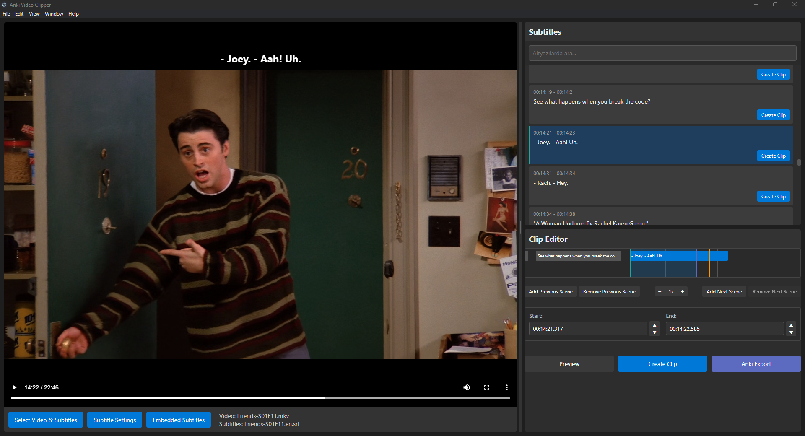
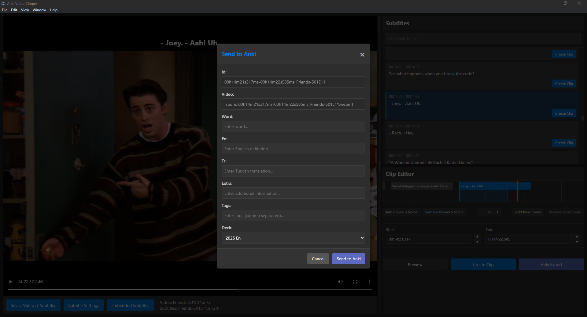

# Anki Video Clipper

An Electron-based application for creating Anki cards while watching films.

## Features

- Video playback and subtitle display
- Dynamic subtitle listing and tracking
- Clip creation and editing
  - Include previous/next scenes
  - Adjust duration
  - Edit subtitle text
- Anki integration (via AnkiConnect API)
- FFmpeg integration for video clip extraction
- Support for various subtitle formats (SRT, ASS, VTT)
- Smart embedded subtitle language detection with visual highlighting for special formats

## Screenshots


*Main interface with video player, subtitle list and clip editor*


*Anki export dialog for creating flashcards*

## Installation

### Pre-built Package

1. Download the appropriate version for your operating system from the [Releases](https://github.com/kullanici/anki-video-clipper/releases) page
2. Run the downloaded installer
3. Launch the application after installation is complete

### Development Setup

1. Clone the repository:
```
git clone https://github.com/kullanici/anki-video-clipper.git
cd anki-video-clipper
```

2. Install dependencies:
```
npm install
```

3. Start the application:
```
npm start
```

## Usage

1. Click the "Select Video & Subtitles" button to select a video file
2. Select a subtitle file (optional)
3. Select one of the subtitles listed in the right panel
4. Make necessary adjustments in the clip editor:
   - Set start/end points
   - Add previous/next scenes (for context)
   - Edit subtitle text
5. Click the "Preview" button to preview the clip
6. Click the "Create Clip" button to create the clip
7. Click the "Send to Anki" button to send the card to Anki

For detailed usage instructions, see the [YARDIM.md](YARDIM.md) file.

## Requirements

- [FFmpeg](https://ffmpeg.org/download.html) (must be installed on the system)
- [Anki](https://apps.ankiweb.net/) and [AnkiConnect](https://ankiweb.net/shared/info/2055492159) plugin

## AnkiConnect Configuration

To properly connect the application with Anki, make sure your AnkiConnect plugin is configured with the following settings:

```json
{
    "apiKey": null,
    "apiLogPath": null,
    "ignoreOriginList": [],
    "webBindAddress": "127.0.0.1",
    "webBindPort": 8765,
    "webCorsOriginList": [
        "https://killergerbah.github.io",
        "http://localhost:3000",
        "file://",
        "chrome-extension://"
    ]
}
```

You can configure these settings by going to Anki → Tools → Add-ons → AnkiConnect → Config.

## Technical Details

The application uses the following technologies:

- [Electron](https://www.electronjs.org/) - Desktop application framework
- [Video.js](https://videojs.com/) - Video player
- [Fluent-FFmpeg](https://github.com/fluent-ffmpeg/node-fluent-ffmpeg) - Node.js wrapper for FFmpeg
- [subtitle](https://github.com/gsantiago/subtitle.js) - Subtitle processing

## Roadmap

- [x] Automatic subtitle tracking
- [x] Dynamic subtitle loading
- [x] Clip creation
- [x] FFmpeg integration
- [x] AnkiConnect integration
- [x] Smart embedded subtitle language detection with special format highlighting
- [x] UI/UX improvements
  - [x] Removed automatic DevTools opening on startup
  - [x] Added proper application menu with File, Edit, View and Help options
- [x] Enhanced subtitle settings and customization
  - [x] Font family selection (Arial, Verdana, Roboto, Open Sans, Noto Sans, Courier New, Times New Roman)
  - [x] Text formatting options (bold, italic)
  - [x] Advanced vertical positioning with custom percentage values
  - [x] Improved UI with dark theme compatible controls
- [ ] Better compatibility with various video codecs
- [ ] First/Last frame capture feature for Anki cards
- [ ] Drag and drop support for video and subtitle files
- [ ] Advanced subtitle search and filtering
- [ ] Third-party player integration (VLC, MPC-HC, etc.)
- [ ] Keyboard shortcuts
- [ ] Settings page

## Known Issues

- [ ] Some subtitle formatting lost during import
- [ ] Timeline zoom needs improvement on high-resolution screens
- [ ] Video player controls overlap with subtitles in some cases
- [ ] Previous subtitle file remains visible when opening a new video file without subtitle

## License

This project is licensed under the MIT License - see the [LICENSE](LICENSE) file for details.